<h1 align="center">Real-Time Forum</h1>

<p align="center">
  A single-page forum written in Go and vanilla JavaScript, where user presence and private messages<br>
  are pushed to open browsers over a WebSocket, without a page refresh.
</p>

<p align="center">
  <a href="go.mod"></a>
  
  
  
</p>

<p align="center">
  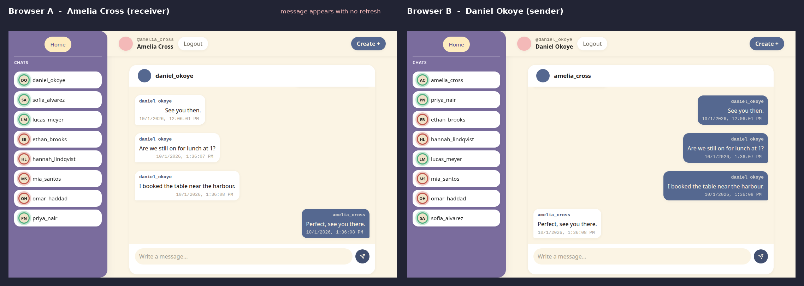
  <br>
  <sub>Two logged-in users in two separate browsers. Daniel sends a message; it shows up in Amelia's open chat with no refresh.</sub>
</p>

## Overview

Real-Time Forum is a **Single Page Application**. The server serves one HTML shell (`frontend/index.html`) and a set of ES modules; after that, every screen (login, register, feed, post, chat) is drawn by JavaScript and the page never does a full navigation.

The app is split along a clear line:

- **HTTP + JSON** carries everything that is a request/response: authentication, posts, comments, chat history, and *sending* a message.
- **One WebSocket per logged-in user** carries everything the server needs to push: who came online or went offline, a new private message for you, and a new user having registered.

It was built by a two-person team with no frontend framework, no bundler and no JavaScript dependencies. The Go side uses the standard `net/http` server, `gorilla/websocket`, SQLite, and `bcrypt`.

## Screenshots

All screenshots were taken from the running application, populated with fictional demo users and content.

<table>
  <tr>
    <td width="50%" align="center">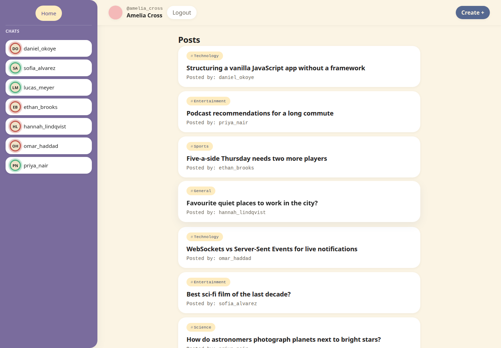<br><sub><b>Feed</b>: newest posts first; the sidebar shows who is online (green ring) or offline (red ring)</sub></td>
    <td width="50%" align="center">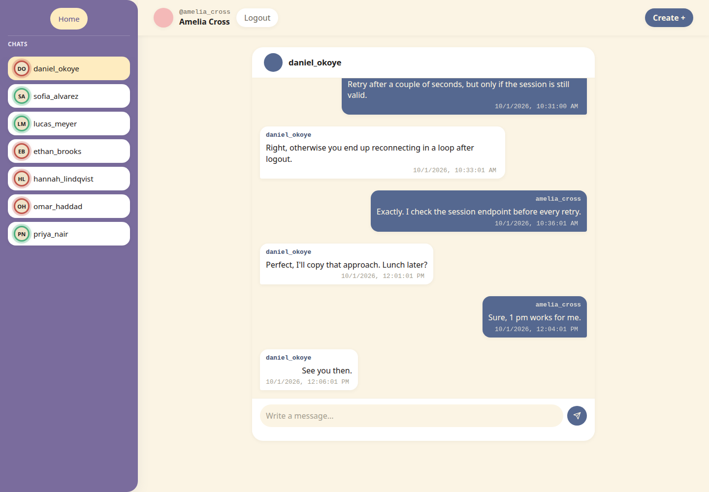<br><sub><b>Private chat</b>: history is loaded 10 messages at a time as you scroll up</sub></td>
  </tr>
  <tr>
    <td width="50%" align="center">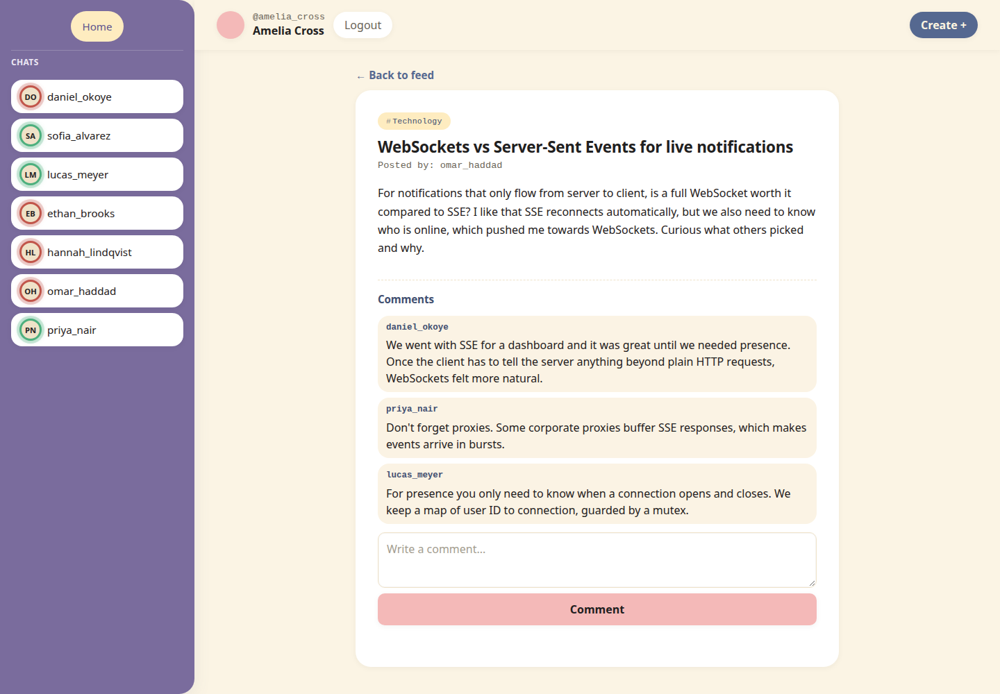<br><sub><b>Post and comments</b></sub></td>
    <td width="50%" align="center">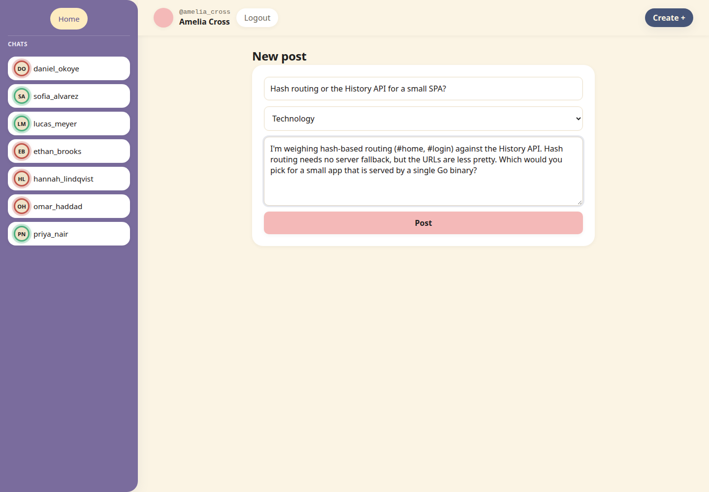<br><sub><b>Create post</b>: five fixed categories</sub></td>
  </tr>
  <tr>
    <td width="50%" align="center">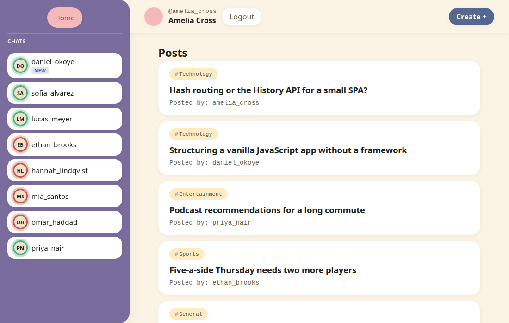<br><sub><b>Live unread badge</b>: a message arrives while the recipient is browsing the feed (Amelia, 1100 px wide viewport)</sub></td>
    <td width="50%" align="center">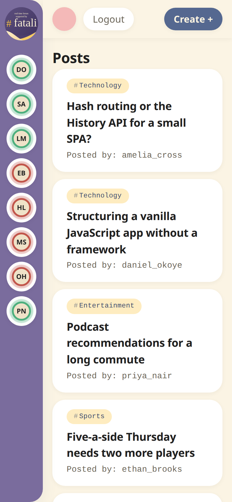<br><sub><b>Narrow screens</b>: the sidebar collapses to avatars (390 px wide viewport)</sub></td>
  </tr>
  <tr>
    <td width="50%" align="center">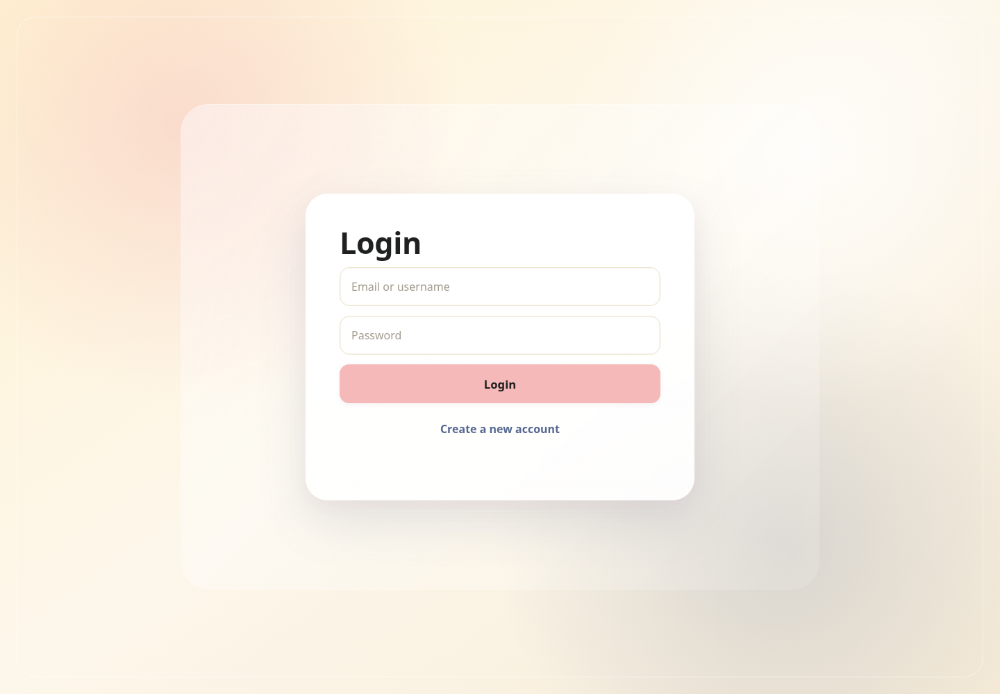<br><sub><b>Login</b> with username or email</sub></td>
    <td width="50%" align="center">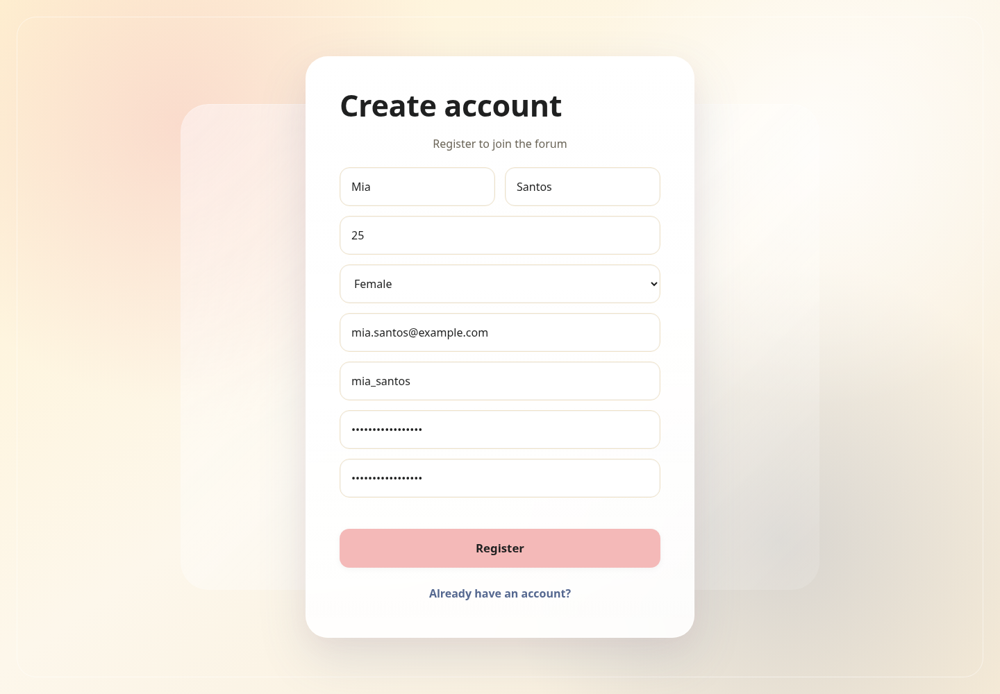<br><sub><b>Register</b></sub></td>
  </tr>
</table>

<details>
<summary>Client-rendered 404 view</summary>
<br>
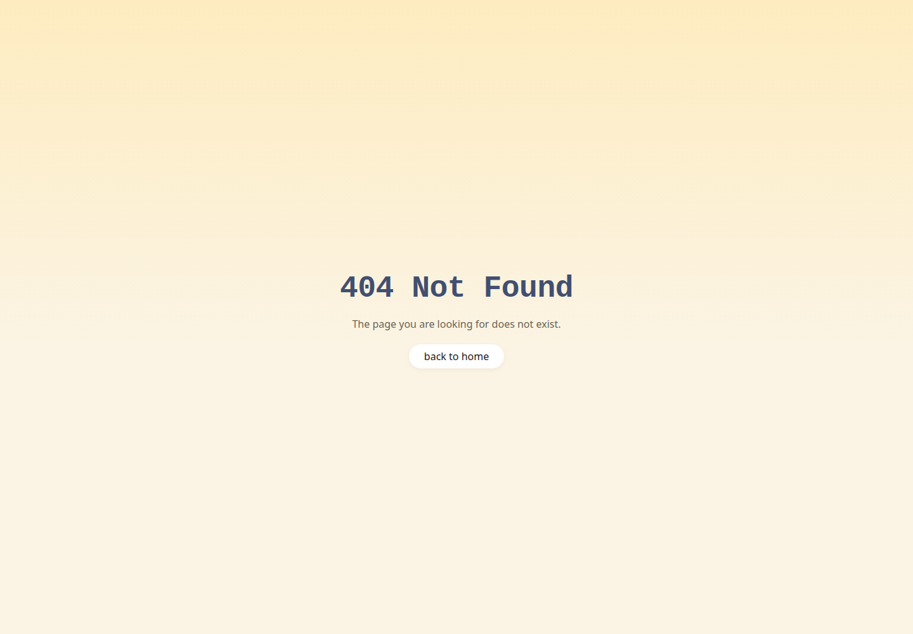
</details>

## Key Features

**Forum**

- Registration with first name, last name, age, gender, email, username and password (with confirmation); login with **either username or email**
- Cookie-based sessions that survive a browser refresh; logout
- Posts with a title, body and one of five fixed categories (General, Technology, Sports, Entertainment, Science)
- Feed of all posts (newest first) and a post detail view
- Comments on posts
- Client-side error views (404, 500) and inline form errors that show the server's message

**Real-time**

- Online / offline indicator for every user in the chat sidebar, updated live
- Private messaging between two users, with the recipient's chat updating live
- "NEW" badge in the sidebar when a message arrives from someone whose chat is not open
- New registrations appear in everyone's sidebar without a refresh
- Chat history persisted in SQLite and loaded in pages of 10 (older messages load when you scroll to the top)
- Sidebar ordered by most recent conversation, then alphabetically
- Automatic socket reconnect (details in [WebSocket Architecture](#websocket-architecture))

## Why This Project Is Interesting

- **No framework, no build step.** About 1,500 lines of ES modules are served as-is and loaded by the browser with `<script type="module">`. Views are plain functions that write into one container; user-supplied text goes in through `textContent` or an `escapeHtml` helper.
- **A hand-written WebSocket hub.** `backend/ws/hub.go` keeps a `map[userID]*client` behind a `sync.RWMutex`, serialises writes with a per-connection mutex (`gorilla/websocket` allows only one concurrent writer), and enforces one connection per user.
- **Persist, then push.** The message handler saves to SQLite first and only then pushes the saved record to the recipient's socket, so what a user sees live is what a later page load will return.
- **Presence comes from live connections, not from the database.** "Online" means "has a registered socket". The sidebar gets a snapshot over HTTP, then incremental events over the WebSocket.
- **The DOM holds the live UI state.** Presence is a `data-online` attribute plus a CSS class on each sidebar button; the unread set is a module-level `Set`. Events update elements in place instead of re-rendering the sidebar.
- **One auth model for both transports.** The same `session_id` cookie is validated before the HTTP-to-WebSocket upgrade happens, so an unauthenticated client never gets a socket.
- **Cursor-based chat paging.** `GET /api/messages/{id}?before_id=N` returns the 10 messages older than `N`; the client keeps the scroll position stable when it prepends them, and the scroll listener is throttled to once per 200 ms.

## Architecture

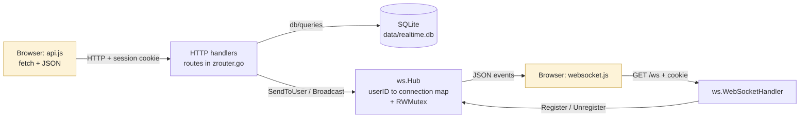

The two browser-side boxes are the same page: `api.js` handles request/response traffic, `websocket.js` receives pushed events.

Static files, the JSON API and the WebSocket endpoint are all served by one Go process on one port. Any path that is not a real file under `frontend/` falls back to `index.html` (`serveFrontend` in `zrouter.go`), which is what lets the SPA own its URLs.

## How the SPA Works

There is a single document, `index.html`, containing `<div id="app">` and `<script type="module" src="js/main.js">`. Everything else is JavaScript replacing the contents of that div.

**Two levels of "routing"**

1. **Top-level pages use the URL hash** (`#login`, `#register`, `#home`). `main.js` listens for `hashchange` and calls `renderPage()` in `router.js`, which also enforces access rules: `#home` without a session renders the login page, and `#login` / `#register` with a session render the home page. An unknown hash renders the 404 view for a logged-in user (the login page otherwise), and any path other than `/` renders the 404 view.
2. **Views inside `#home` are swapped by function call, not by URL.** `navigateHome("feed" | "create-post" | "post", data)` in `pages/home.js` replaces the contents of `#home-container`; clicking a user in the sidebar renders the chat view into the same container. The sidebar and top bar stay mounted, so the WebSocket-driven presence dots are never torn down while you move between views.

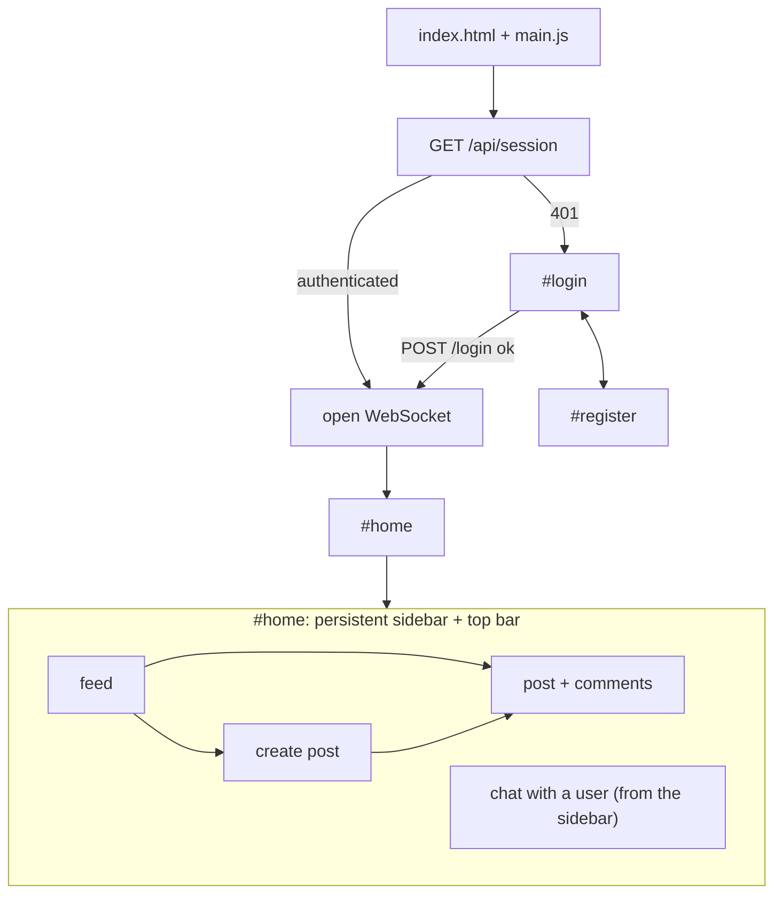

**State.** There is no store. The few pieces of long-lived state are module variables: `currentUser` (`auth.js`), the `socket` (`websocket.js`), the unread `Set` (`pages/home/sidepar.js`) and the chat paging cursor (`pages/home/message.js`). Everything else is fetched when a view renders.

**Talking to the backend.** `api.js` wraps `fetch` with `credentials: "same-origin"`, JSON encoding, and a uniform `{ ok, status, error, data }` result (network failures included). The data-loading views check `document.body.contains(element)` after each `await`, so a slow response is not rendered into a view the user has already left. A `500` response renders the full-page error view; other errors are shown inline.

**Consequence of this design.** Views inside `#home` have no URL of their own, so refreshing while reading a post or a chat returns you to the feed (you stay logged in), and the browser Back button does not step between them.

## WebSocket Architecture

### Connection lifecycle

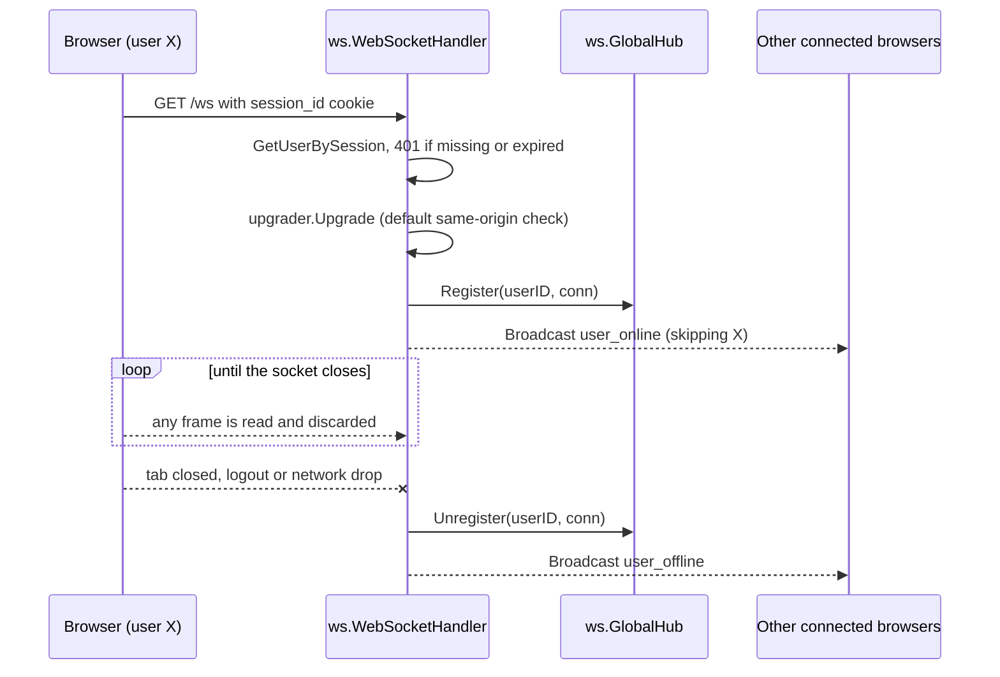

- **Endpoint:** `GET /ws`, same origin as the page. The client builds the URL from `window.location.host` (`ws://…`).
- **Who connects:** `connectWebsocket()` in `frontend/js/websocket.js` runs once a session is confirmed, either on app start (`startApp()` in `router.js`) or after a successful login.
- **Identification:** the handler reads the `session_id` cookie and resolves it to a user *before* upgrading. There is no token in the URL and no handshake message.
- **Origin check:** `gorilla/websocket`'s default `CheckOrigin` is used; a request with a foreign `Origin` header is rejected. Verified: no cookie gives `401`, a cookie with `Origin: http://evil.example` gives `403`, the same origin upgrades.
- **Direction:** the socket is **server to client only**. The read loop exists to notice disconnects; frames from the client are read and dropped. Verified by sending a `new_message` frame from a raw client: nothing was delivered or stored.
- **One connection per user:** registering a second connection for the same user closes the first.

### Events

Every frame is JSON of the form `{ "type": string, "content": object }`. These are the only four event types, captured from a real session:

```json
{"type":"user_online","content":{"user_id":2,"username":"daniel_okoye"}}
{"type":"user_offline","content":{"user_id":6,"username":"omar_haddad"}}
{"type":"new_user_registered","content":{"first_name":"Mia","last_name":"Santos","username":"mia_santos"}}
{"type":"new_message","content":{"id":23,"sender_id":2,"receiver_id":1,"username":"daniel_okoye","content":"Are we still on for lunch at 1?","created_at":"2026-10-01T13:36:07.452853395+03:00"}}
```

| Event | Sent by | Sent to | What the frontend does (`websocket.js`) |
|---|---|---|---|
| `user_online` | `WebSocketHandler`, after `Register` | everyone except that user | `updateUserOnlineDot()` sets `data-online="true"` and swaps the dot to `.online` |
| `user_offline` | `WebSocketHandler`, in a deferred cleanup | everyone except that user | same function, sets it offline |
| `new_message` | `MessageHandler` (HTTP), after the INSERT | the recipient only | `handleIncomingMessage()`: if that sender's chat is open, `appendMessage()`; otherwise `markUserUnread()` shows the NEW badge |
| `new_user_registered` | `RegisterHandler` (HTTP) | everyone | `updateSidebarUsers()` re-fetches `GET /api/chat-users` and re-renders the list |

### Reconnect behaviour

`socket.onclose` ignores intentional closes (logout calls `disconnectWebsocket()`). Otherwise it asks `GET /api/session`: if the session is still valid it reconnects after 2 seconds; if the request fails or the session is gone it reloads the page. Verified by restarting the server while a page was open: the page reloaded and its socket was registered again on the new process.

### Concurrency model

- `net/http` runs each request in its own goroutine. The goroutine that handles `GET /ws` stays alive for the connection's lifetime, blocked in the read loop.
- There are **no channels and no dedicated writer goroutines**. An event is written synchronously by whichever goroutine triggers it: the HTTP handler's goroutine for `new_message` and `new_user_registered`, the connection's own goroutine for `user_online` / `user_offline`.
- `Hub.mu` (`sync.RWMutex`) protects the `clients` map. `client.writeMu` (`sync.Mutex`) serialises writes to a single connection, because several goroutines can target the same user at once.
- `SendToUser` holds the read lock only for the map lookup and writes outside it; `Broadcast` holds the read lock while it writes to every client.
- `Unregister` only removes an entry if it still points at the connection being closed, so a stale connection cannot evict its replacement.
- SQLite access is serialised separately: the `database/sql` pool is capped with `SetMaxOpenConns(1)`.

## Real-Time Messaging Flow

One message, from sender to recipient. Daniel (sender) and Amelia (recipient) each have the app open and a registered socket.

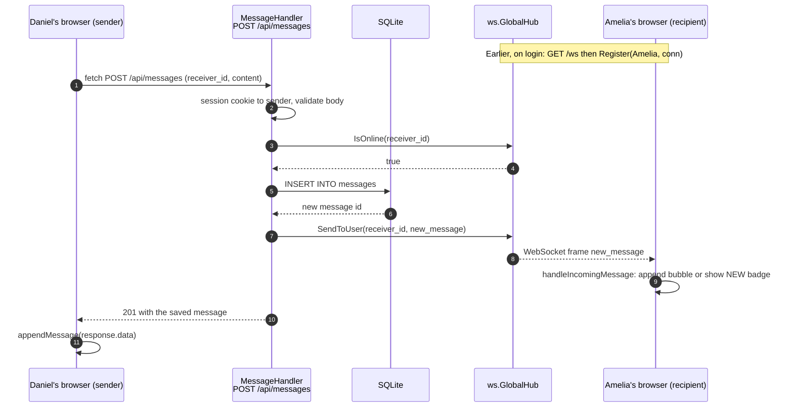

1. **Compose.** `handleMessageFormSubmit()` in `frontend/js/pages/home/message.js` trims the input and calls `apiFetch("/api/messages", { method: "POST", body: { receiver_id, content } })`.
2. **Authenticate and validate.** `MessageHandler` in `backend/handlers/message_handlers.go` resolves the `session_id` cookie to the sender, then rejects: a receiver id ≤ 0, messaging yourself, empty content or content over 500 bytes, and **a receiver that is not currently online** (`GlobalHub.IsOnline`).
3. **Persist.** `queries.InsertMessage()` in `backend/db/queries/message_queries.go` inserts the row and returns its id.
4. **Push.** The handler builds a `structures.Message` (id, sender, receiver, sender username, content, timestamp) and calls `ws.GlobalHub.SendToUser(receiverID, Event{Type: "new_message", Content: msg})`. This is the only place a chat message touches the WebSocket.
5. **Respond.** The same `Message` is returned as the `201` body. The sender's UI appends it from that response (`appendMessage`); the sender is not sent a socket echo.
6. **Receive.** In the recipient's browser `socket.onmessage` dispatches on `type` and calls `handleIncomingMessage()`. If `#messages-list[data-user-id]` matches the sender, the bubble is appended and scrolled into view; otherwise `markUserUnread()` in `sidepar.js` adds the NEW badge, which `clearUserUnread()` removes when that chat is opened.
7. **Later.** Opening the chat, or reloading the page, calls `GET /api/messages/{userID}`, which reads the same rows back.

In one local run with two headless browsers, the time from the sender's click to the bubble appearing in the recipient's DOM was about 140 ms (this includes the browser-automation overhead).

## HTTP vs WebSocket Responsibilities

| Operation | Transport | Endpoint / event |
|---|---|---|
| Register, login, logout | HTTP | `POST /register`, `POST /login`, `POST /logout` |
| Who am I / is my session valid | HTTP | `GET /api/session` |
| Load the user list (with `online` flag) | HTTP | `GET /api/chat-users` |
| Presence changes | **WebSocket** | `user_online`, `user_offline` |
| A new user appears in the sidebar | **WebSocket** signal, then HTTP | `new_user_registered`, then `GET /api/chat-users` |
| Feed, post detail | HTTP | `GET /posts`, `GET /posts/{id}` |
| Create post | HTTP | `POST /posts` |
| List / add comments | HTTP (list is re-fetched after posting; comments are not pushed) | `GET` / `POST /posts/{id}/comments` |
| Chat history (paged) | HTTP | `GET /api/messages/{userID}?before_id=` |
| Send a message | HTTP | `POST /api/messages` |
| **Deliver** a message to the recipient | **WebSocket** | `new_message` |
| Unread "NEW" badge | Client-side state driven by `new_message` (in memory, lost on refresh) | n/a |

## Tech Stack

| Layer | Technology |
|---|---|
| Server language | Go (`go 1.25.0` in `go.mod`; built and run with Go 1.27.1) |
| HTTP | standard library `net/http` with method + wildcard route patterns (`POST /login`, `GET /posts/{id}`) |
| WebSocket | [`github.com/gorilla/websocket`](https://github.com/gorilla/websocket) v1.5.3 |
| Database | SQLite through [`github.com/mattn/go-sqlite3`](https://github.com/mattn/go-sqlite3) v1.14.47 (**cgo**, needs a C compiler) |
| Password hashing | `golang.org/x/crypto/bcrypt` (`golang.org/x/crypto` v0.53.0), default cost |
| Frontend | HTML, JavaScript ES modules, CSS. No framework, bundler, npm or transpiler |
| Styling | Plain CSS split by concern and stitched together with `@import` in `css/style.css`; design tokens as CSS custom properties; a responsive stylesheet |
| Schema management | Numbered `.sql` files applied in filename order at every start-up |

## Project Structure

```text
real-time-forum/
├── main.go                      # entry point: config → router → database → ListenAndServe
├── go.mod / go.sum
├── backend/
│   ├── config/config.go         # port, DB path, migrations path (hard-coded values)
│   ├── db/
│   │   ├── db.go                # open SQLite, enable foreign keys, run migrations
│   │   ├── migration/           # 001–005: users, posts, comments, messages, sessions
│   │   └── queries/             # SQL + Go functions: user_, post_ (and comments), message_
│   ├── global/
│   │   ├── variables.go         # the shared *sql.DB
│   │   ├── structures/          # request, response and domain structs
│   │   └── utilities/json.go    # ReadJSON, WriteJSON, ErrorJSON
│   ├── handlers/                # auth, post, comment, message, user handlers + zrouter.go
│   └── ws/
│       ├── hub.go               # connection registry, SendToUser, Broadcast
│       └── websocket.go         # GET /ws: auth, upgrade, register, cleanup
├── frontend/
│   ├── index.html               # the single HTML shell: <div id="app">
│   ├── css/                     # style.css (imports) · variables · base · layout · responsive · views/*
│   └── js/
│       ├── main.js              # boot + hashchange listener
│       ├── router.js            # page guard and renderPage()
│       ├── auth.js · api.js     # current user · fetch wrapper, escapeHtml
│       ├── websocket.js         # socket lifecycle + event dispatch
│       └── pages/               # login · register · error · home (+ home/ feed, createPost,
│                                #   postView, sidepar, message, topbar)
└── docs/screenshots/            # images used in this README
```

At run time the app also creates `data/realtime.db` (ignored by Git).

## Database

SQLite file at `./data/realtime.db`. `StartDatabase()` opens it, runs `PRAGMA foreign_keys = ON`, caps the pool at one connection and executes every `.sql` file in `backend/db/migration/` in order. The migrations use `CREATE TABLE IF NOT EXISTS`, so re-running them on an existing database is harmless; there is no version-tracking table.

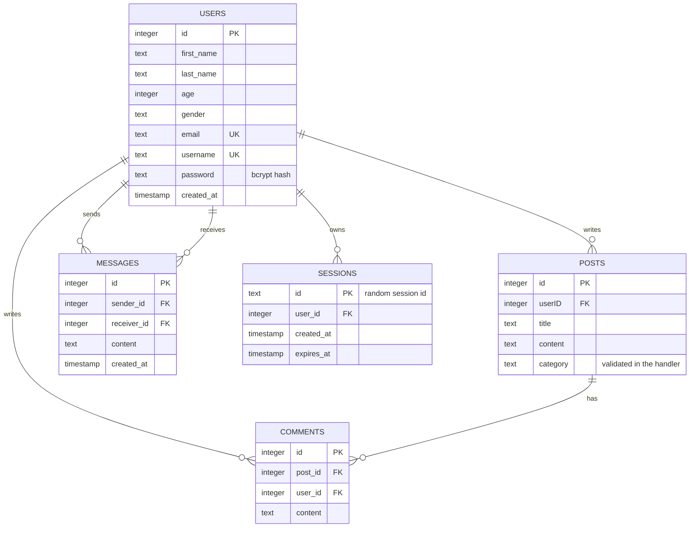

Categories are not a table: `posts.category` is plain text and `CreatePostHandler` accepts only the five names in `validCategories`. Online status is not stored anywhere; it is read from the WebSocket hub.

<details>
<summary>Validation limits enforced by the backend</summary>

| Input | Rule |
|---|---|
| Registration | All fields required; password ≥ 8 characters, no whitespace, must match confirmation; username must not contain a space; first and last name ≤ 20 characters; gender `male` or `female`; email must match a regex; age 1–100. Email and username must be unique (enforced by the database; see [limitations](#known-limitations--future-work)) |
| Post | Title ≤ 100 characters; content under 1,000 bytes; category must be one of the five |
| Comment | Non-empty after trimming; under 10,000 bytes; the post must exist |
| Chat message | Non-empty; ≤ 500 bytes; receiver must exist as another user and be online |

</details>

## Authentication & Sessions

- **Passwords** are hashed with `bcrypt.GenerateFromPassword` (default cost). The database column holds the 60-character bcrypt string.
- **Login** takes one `identifier` that is matched against `username` *or* `email`, compares with `bcrypt.CompareHashAndPassword`, and returns the username.
- **Session id:** 32 bytes from `crypto/rand`, hex-encoded (64 characters), stored in the `sessions` table with a 24-hour `expires_at`.
- **Cookie:** `session_id`, `Path=/`, `HttpOnly`, `SameSite=Lax`, expiring after 24 hours. There is no `Secure` flag, because the app is served over plain HTTP.
- **One active session per user:** logging in deletes that user's earlier sessions first.
- **Checking a session:** every protected handler reads the cookie and calls `queries.GetUserBySession()`. An expired session is deleted when it is presented.
- **Logout** deletes the session row and expires the cookie; the client then closes its socket and clears `currentUser`.
- **The SPA's view of auth:** on load it calls `GET /api/session`; `200` with `authenticated: true` populates `currentUser`, `401` means show the login page.
- **WebSocket:** authenticated once, at connection time, by the same cookie.
- **No CSRF token** is used; the cookie's `SameSite=Lax` attribute is the only CSRF mitigation in place.

## Getting Started

### Prerequisites

- **Go 1.25 or newer** (the module declares `go 1.25.0`)
- **A C compiler** (`gcc` or `clang`), because `go-sqlite3` uses cgo. With `CGO_ENABLED=0` the project builds but fails at start-up with *"go-sqlite3 requires cgo to work"*
- Git and a modern browser

No Node.js, npm or separate SQLite installation is needed. These steps were run on Linux; other platforms were not tested.

### Clone

```bash
git clone https://github.com/hussainhht/real-time-forum.git
cd real-time-forum
```

### Install dependencies

```bash
go mod download
```

(`go run` would fetch them anyway. The first build also compiles SQLite and takes about half a minute.)

### Run

Run from the repository root; the server reads `./frontend` and `backend/db/migration` relative to the working directory.

```bash
go run .
```

You should see the migrations being applied, then:

```text
db is open now
Find the best real time forum on http://localhost:4444
```

### Open in browser

Go to **http://localhost:4444**.

The port (`:4444`) and database path (`./data/realtime.db`) are hard-coded in `backend/config/config.go`. To start with an empty database, stop the server and delete the `data/` directory.

> **Trying real-time with two users:** browsers share one cookie jar per profile, so open the second user in a private window or a different browser profile. Both users must be online for a message to be accepted.

## Usage

1. **Register** an account (first name, last name, age, gender, email, username, password twice), then **log in** with your username or email.
2. The **feed** lists every post, newest first. Click one to read it and its comments, and add your own comment.
3. Click **Create +** in the top bar to write a post and pick a category.
4. The **sidebar** lists everyone else. A green ring means the person is online, a red ring means offline. Click a name to open your conversation; scroll up to load older messages.
5. Send a message to someone who is online. If you are on another view when one arrives, the sender gets a **NEW** badge in your sidebar.
6. **Logout** is in the top bar. You can refresh at any time and stay logged in for 24 hours.

## Team & Contributions

Two people built this project over 86 commits between 28 June and 17 August 2026. The areas below are drawn from `git log --numstat`, commit messages and `git blame` on the current tree. The two worked together closely: 15 commits carry `Co-authored-by` trailers crediting the other member.

| Team member | Role | Main contributions (from Git history) |
|---|---|---|
| **Nawraa Sayed** ([`NawraaSayed`](https://github.com/NawraaSayed); also committed as `nawraasayed` and `nsayed`) | **Team Leader** | **Database layer and schema:** the migration runner in `db/db.go`; consolidating the schema down to users, posts, comments, messages and sessions (the early like, dislike and category tables were dropped); the user, post and comment queries.<br><br>**Backend handlers:** most of `auth_handlers.go` (login, registration, session cookie), the `/api/session` endpoint, and the comment, post and user handlers, plus review passes over the whole backend, JSON error responses, request-size limits and the later username validation.<br><br>**WebSocket backend:** all of `ws/hub.go`, the reworked `ws/websocket.go`, the `new_user_registered` broadcast, and the logout/reconnect handling in `websocket.js`.<br><br>**Frontend core:** `api.js`, `auth.js`, the `router.js` refactor, hash routing, the error and 404 views, and the feed and create-post views.<br><br>**Real-time UI:** the online-status circles and the NEW unread badge.<br><br>**Styling:** the CSS architecture (variables, base, layout, per-view files, responsive rules); every CSS line in the current tree is attributed to Nawraa by `git blame`. Also wrote the earlier README. |
| **HUSSAIN ALI H. ALI** ([`hussainhht`](https://github.com/hussainhht); committed as `hussainali7`) | Developer | **Project foundations:** the first schema and server bootstrap, the Go module layout, the `config` package, the initial structs and `.gitignore`, and the first router with static-file serving.<br><br>**Backend:** registration validation and bcrypt hashing, user and login queries, the confirm-password field, `GetPostByID` with `GET /posts/{id}`, and the **messaging backend**: the message structs, the cursor-paginated history query (`message_queries.go` is entirely Hussain's by `git blame`) and the first message handlers, which both members later extended.<br><br>**WebSocket:** the first `/ws` endpoint and client connection, then wiring socket events into the chat UI.<br><br>**Frontend:** the first login and register pages and router, the home layout, top bar, sidebar user list, the first version of the post view, and most of the **chat UI** (`message.js`: history loading, lazy-loading of older messages, scroll throttle). Early stylesheet iterations that were later replaced by the modular CSS. |

<details>
<summary>How the roles line up with the code today (<code>git blame</code>, surviving lines)</summary>

| Area | Lines by Nawraa Sayed | Lines by Hussain Ali |
|---|---:|---:|
| `backend/handlers` | 627 | 151 |
| `backend/db` (migrations and queries) | 388 | 217 |
| `backend/ws` | 142 | 26 |
| `frontend/js/pages` | 432 | 721 |
| `frontend/js` core (`main`, `router`, `auth`, `api`, `websocket`) | 275 | 77 |
| `frontend/css` | 1,698 | 0 |

These are surviving lines only and say little about effort: for example, the first WebSocket endpoint and the chat UI were Hussain's work, and much of that code was later rewritten or extended by both members.

</details>

## Engineering Highlights

- **Managing persistent connections.** Registration, replacement and cleanup of one socket per user, with an `Unregister` that checks connection identity so a stale socket cannot remove a newer one.
- **Coordinating two transports.** Writes stay on HTTP (one validation path, ordinary status codes, the sender gets the saved record back) and the socket is used only to push. The cost is that the server must keep the two consistent: a message is stored first and pushed second, and a failed push is only logged. A failed push does not lose the message, because chat history is read back from the database.
- **Keeping several browsers in sync.** Presence and unread state are applied as targeted DOM updates when events arrive, and the app was exercised with multiple simultaneous browser contexts (login, offline/online transitions, a new registration, a message arriving in an open chat versus a closed one).
- **Race-safe UI updates.** The data-loading views re-check that their container is still in the document after each `await`, which prevents late responses from drawing into the wrong screen.
- **Security basics for a hand-built stack.** bcrypt hashing, `HttpOnly` + `SameSite` session cookies, session validation before the WebSocket upgrade, same-origin WebSocket checking, parameterised SQL everywhere, and HTML-escaping of user content on the client.
- **Pagination that survives live updates.** Paging by message id (not by offset) means newly arriving messages do not shift the pages already loaded.

## Known Limitations & Future Work

These are observations from reading and running the code, not existing features.

| Today | Possible improvement |
|---|---|
| The socket is receive-only; sending a message is an HTTP `POST` | Send chat messages over the socket (with an acknowledgement event) if lower latency or typing indicators are wanted |
| A message can only be sent to a user who is **online**; the server returns `400` otherwise | Allow sending to offline users and deliver on their next connection, using the already-persisted rows |
| Only one socket per user. Two tabs of the same account keep replacing each other: each reconnect closes the other tab's socket, producing a reconnect loop and repeated `user_online`/`user_offline` events (about 6 re-registrations in 11 seconds in a test) | Allow several connections per user, and mark the user offline only when the last one closes |
| No ping/pong heartbeat or read/write deadlines; `Broadcast` writes to every client while holding the hub's read lock | Heartbeats and deadlines, plus a buffered send channel and writer goroutine per client |
| Posts and comments are not pushed live; the feed is loaded when the view renders and returns every post at once | Broadcast new posts/comments, and paginate the feed |
| Categories are a fixed list stored as text and are not filterable in the UI | A categories table and a filter on the feed |
| Views inside `#home` have no URL, so refresh returns to the feed and Back does not navigate between posts or chats | Hash or History-API routes for post and chat views |
| Port and database path are hard-coded; the server must be started from the repository root | Read configuration from environment variables or flags |
| Cookie has no `Secure` flag and the client always connects to `ws://` | Support HTTPS (`Secure` cookie, `wss://`) |
| The unread "NEW" state lives only in browser memory | Store a read marker per conversation |
| Registering with a username or email that already exists fails on the database `UNIQUE` constraint and is returned as HTTP `500`, so the SPA shows its generic 500 page instead of a form message | Map the constraint error to `409 Conflict` with a clear message, and show it inline |
| No automated tests | Handler tests with `httptest`, and a WebSocket integration test for the hub |

---

<sub>Screenshots and the flows described above were produced by running the application locally and driving it with a headless browser against fictional demo data (users such as `amelia_cross` with `example.com` addresses), created through the application's own API.</sub>
